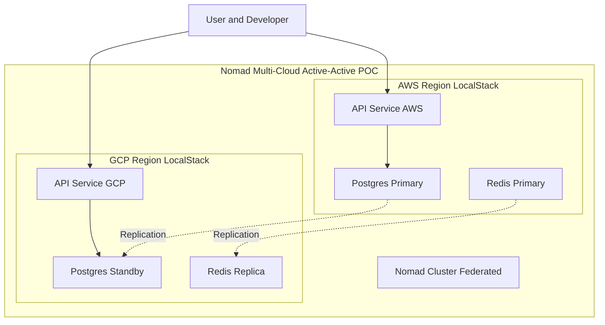

# 🌐 Nomad Multi-Cloud Active-Active POC


> **A robust Proof of Concept demonstrating Active-Active architecture across simulated AWS and GCP environments.**

---

## 📖 Overview

This project simulates a **Multi-Region Active-Active** architecture using **HashiCorp Nomad** for orchestration and **LocalStack** to represent cloud providers (AWS and GCP). It allows you to test:

*   **Data Replication** (PostgreSQL & Redis)
*   **Network Partitioning & Recovery**
*   **Failover Scenarios**
*   **Cross-Region Latency**

It runs **100% locally** using Docker and Go, making it an ideal playground for distributed systems engineering without incurring cloud costs.

---

## 🏗 Architecture

The system simulates two distinct cloud regions connected via a virtual "VPN".



---

## ✨ Key Features

*   **⚡ Multi-Cloud Simulation**: Runs simulated AWS (us-east-1) and GCP (us-central1) environments on localhost.
*   **🕸️ Chaos Engineering**: Built-in scripts to simulate network partitions (VPN down), latency, and packet loss.
*   **🔄 Data Consistency**: PostgreSQL Streaming Replication and Redis Asynchronous Replication.
*   **🛠️ HashiCorp Stack**: Uses Nomad for workload orchestration and Consul for service discovery.
*   **🛡️ Resiliency**: Handles failover and recovery scenarios automatically.

---

## 🚀 Quick Start

### Prerequisites
*   [Docker](https://www.docker.com/) & Docker Compose
*   [Go 1.21+](https://go.dev/)
*   [Make](https://www.gnu.org/software/make/)

### 1. Configuration
Create your environment file. **Do not commit `.env` files.**
```bash
cp .env.example .env
# Edit .env and set secure passwords for POSTGRES_PASSWORD etc.
```

### 2. Start the Cluster
Launch the entire stack (Infrastructure + Application). This spins up the Docker containers and Nomad jobs.
```bash
make up
```

### 3. Access the APIs
The services are exposed on different ports to simulate different regions:
*   **AWS Region API**: `http://localhost:8081`
*   **GCP Region API**: `http://localhost:8082`

### 4. Run Tests
Execute the Active-Active scenario test to verify replication and connectivity:
```bash
make test-active-active
```

---

## 📚 Documentation Index

| Document | Description |
|----------|-------------|
| [**Setup Guide**](docs/SETUP.md) | Detailed installation, configuration, and running instructions. |
| [**API Reference**](docs/API.md) | API endpoints, request/response formats, and examples. |
| [**Architecture**](docs/ARCHITECTURE.md) | Deep dive into system design, components, and data flow. |
| [**Network Rules**](docs/NETWORK_RULES.md) | How the network simulation (iptables/tc) works. |
| [**Secrets**](docs/SECRETS.md) | Security policies and secret management. |
| [**Problems**](docs/PROBLEMS.md) | Common distributed system challenges handled here. |
| [**Agents**](docs/AGENTS.md) | Guidelines for AI Agents and Developers working on this repo. |

---

## 🛠 Tech Stack

*   **Language:** Go (Golang) 1.21
*   **Orchestration:** HashiCorp Nomad
*   **Database:** PostgreSQL (Primary/Standby)
*   **Caching/Queue:** Redis
*   **Infrastructure:** Terraform (LocalStack)
*   **Containerization:** Docker & Docker Compose
*   **Monitoring:** Grafana (implied by env vars)

---

## 🧪 Chaos Engineering Scenarios

This POC shines in its ability to break things to see how the system recovers. You can use the `Makefile` targets or scripts in `scripts/network_sim/` to simulate failures:

*   **Simulate Network Partition:**
    ```bash
    make partition-start  # Breaks connection between AWS and GCP
    make partition-stop   # Restores connection
    ```
*   **Latency Injection:**
    ```bash
    # Run script directly (requires sudo/root in container)
    ./scripts/network_sim/add_latency.sh
    ```

---

## 📄 License

This project is licensed under the MIT License - see the [LICENSE](LICENSE) file for details.
