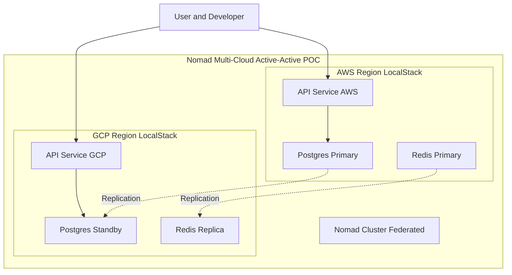
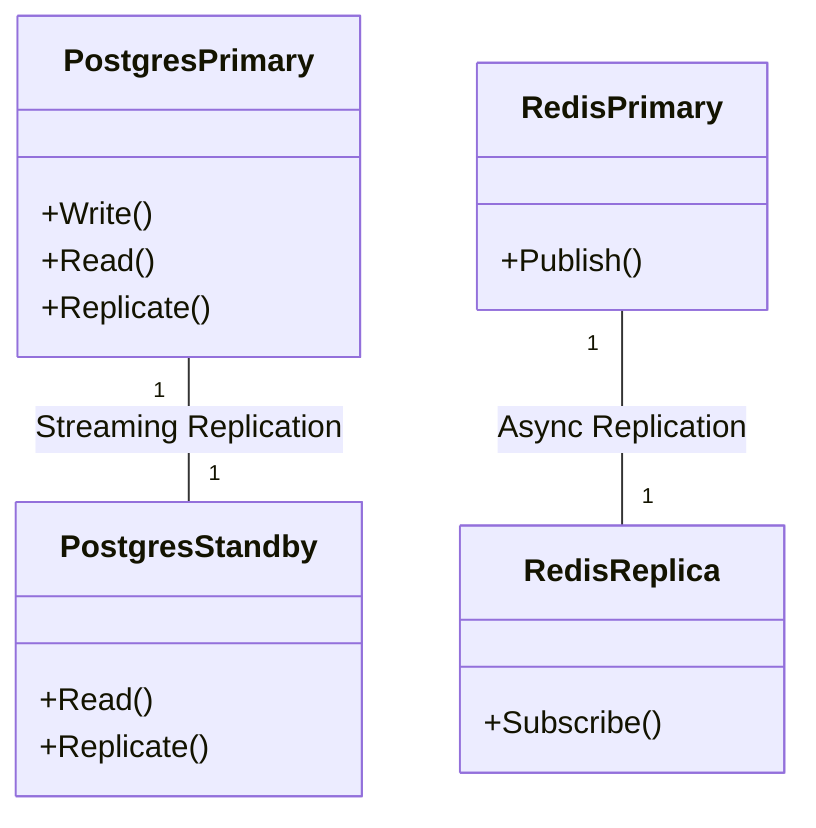
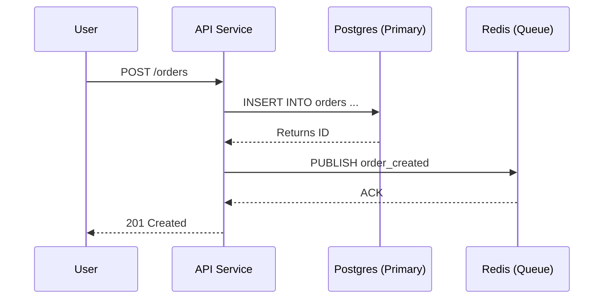

# Architecture

This document describes the high-level architecture of the Nomad Multi-Cloud Active-Active POC.

## Overview

The system simulates a multi-region Active-Active architecture using LocalStack to represent AWS and GCP regions. HashiCorp Nomad orchestrates the workloads across these regions.



## Components

### 1. Infrastructure Layer (Simulated)
*   **AWS Region (us-east-1)**:
    *   Simulated by `localstack-aws` container.
    *   Network: `172.20.0.0/16`
    *   Services: EC2, RDS, ElastiCache.
*   **GCP Region (us-central1)**:
    *   Simulated by `localstack-gcp` container (configured as a generic second cloud).
    *   Network: `172.21.0.0/16`
    *   Services: Compute, SQL (simulated via Docker containers on this network).

### 2. Data Layer
*   **PostgreSQL**:
    *   **Primary**: Located in AWS Region (`postgres-aws-primary`).
    *   **Standby**: Located in GCP Region (`postgres-gcp-standby`), replicating from Primary.
    *   **Replication**: Streaming replication is configured.
*   **Redis**:
    *   **Primary**: AWS Region (`redis-aws`).
    *   **Replica**: GCP Region (`redis-gcp`).



### 3. Orchestration Layer
*   **Nomad**:
    *   **Server AWS**: Runs in AWS network, Datacenter `aws`.
    *   **Server GCP**: Runs in GCP network, Datacenter `gcp`.
    *   **Federation**: The two servers are federated to form a single cluster spanning multiple regions.

### 4. Application Layer
*   **API Service**:
    *   Go-based REST API.
    *   Deployed as Nomad jobs (simulated via Docker containers `api-aws` and `api-gcp` for this POC).
    *   Connects to local region's database (Primary or Standby) and Redis.
*   **Consumer Service**:
    *   Processes background tasks (if applicable).

#### Request Flow (Order Creation)



## Networking

*   **VPN Simulation**: Scripts in `scripts/network_sim/` simulate network conditions.
    *   `vpn_down.sh`: Blocks traffic between `172.20.x.x` and `172.21.x.x` to simulate a network partition.
    *   `vpn_up.sh`: Restores connectivity.
    *   Latency can be injected to simulate cross-region delays.

#### Network Partition Simulation

```mermaid
graph LR
    subgraph "AWS Network (172.20.0.0/16)"
        Nomad_AWS[Nomad AWS]
    end

    subgraph "GCP Network (172.21.0.0/16)"
        Nomad_GCP[Nomad GCP]
    end

    Nomad_AWS <-->|Normal State| Nomad_GCP
    Nomad_AWS -.-x|Partitioned (vpn_down.sh)| Nomad_GCP
```

## Conflict Resolution

*   **Last-Write-Wins (LWW)**: Used for active-active data conflict resolution if writes are enabled in both regions (though currently set up as Primary-Standby for Simplicity, the architecture supports promoting the Standby).
